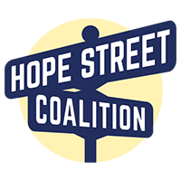

--- 
title: "Homeless Online Database Project"
author: "Alec Nguyen"
site: bookdown::bookdown_site
bibliography: references.bib
biblio-style: apalike
link-citations: yes
---

# About {-}

Database Source Code - https://github.com/alecng27/Homeless_Online_Database

This project is the end result from the internship with Hope Street Coalition.
The goal is to create a database to help the public and decision makers understand HUD homelessness data- particularly the trends of homelessness counts and how they compare with housing inventory trends. The database provides an ability to compare local data with state data and generate graphic representations of the data.

**Sources**

[Awards and Allocations](https://www.hudexchange.info/grantees/allocations-awards/)

[Awards by Project component and Type](https://www.hudexchange.info/programs/coc/awards-by-component/)

[PIT and HIC Data Since 2007](https://www.hudexchange.info/resource/3031/pit-and-hic-data-since-2007/)

[Homeless Populations and Subpopulations Reports](https://www.hudexchange.info/programs/coc/coc-homeless-populations-and-subpopulations-reports/)

**Author**

Alec Nguyen

Economics & Data Science B.A, Lawrence University

alec.nguyen27@gmail.com

[LinkedIn](https://www.linkedin.com/in/alec-nguyen-about/)

[Project Portfolio](https://alecng27.github.io/Project_Portfolio/)

<!-- 
   -->
<!--   -->
<!-- 
 -->

**Sponsor**

Hope Street Coalition - http://www.hopestreetcoalition.org

A 501(c)(3) nonprofit organization that advocates to change public policies and fix the broken homelessness, mental illness, 
and addiction treatment policies at the state and national level. The benefits of these changes will be saved lives and improved communities. 
Contact Hope Street at info@hopestreetcoalition.org
  

  
  

           

